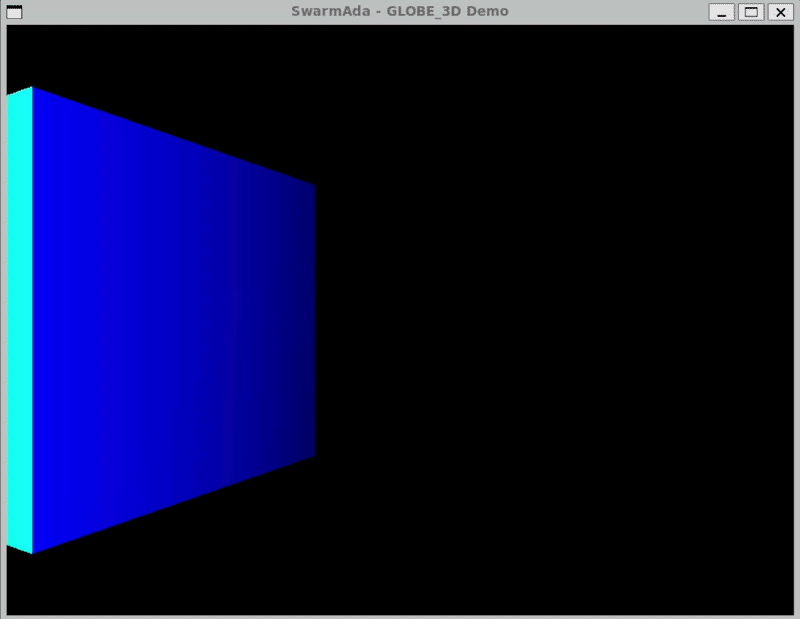

# SwarmAda - 3D Drone Swarm Simulator with Ada + Lua

[](https://www.adacore.com/)
[](https://www.lua.org/)
[](LICENSE)
[](https://alire.ada.dev/)

A real-time 3D swarm simulation framework combining the robustness and performance of **Ada** with the flexibility and simplicity of **Lua scripting**. Built with GLOBE_3D for 3D rendering.

## 🎯 Overview

**SwarmAda** is a proof-of-concept project demonstrating how to:

- Use Ada as the core engine for high-performance 3D rendering and physics
- Expose a clean API to Lua for controlling objects in real-time
- Combine the safety of Ada with the agility of Lua for drone swarm simulations
- Create configurable behaviors without recompiling the core engine

Perfect for researchers, robotics enthusiasts, and anyone interested in multi-agent systems.

## ✨ Features

- **3D Rendering**: Powered by GLOBE_3D (OpenGL-based engine)
- **Lua Scripting**: Define drone behaviors in Lua with full control
- **Real-time Control**: Update objects at 60+ FPS
- **Lightweight**: Minimal dependencies, runs on Linux (WSL supported)
- **Extensible**: Easy to add new API functions and behaviors
- **Educational**: Clean codebase ideal for learning Ada-Lua integration

## 🎮 Demo

The included demo shows a single cube moving in a circular path controlled by a Lua script. The position and rotation are updated every frame via Lua function calls.



## 🛠️ Architecture

```
┌─────────────────────────────────────────────┐
│              Ada Core Engine                │
├─────────────────────────────────────────────┤
│  • GLOBE_3D Rendering Engine               │
│  • GLUT Window Management                  │
│  • Object Management (3D models)           │
│  • Camera Control                         │
│  • Lighting System                        │
├─────────────────────────────────────────────┤
│              Lua Bridge                     │
├─────────────────────────────────────────────┤
│  • Ada functions exposed to Lua            │
│  • Script loading and execution            │
│  • Function reference management           │
│  • Error handling                         │
└─────────────────────────────────────────────┘
                     ▲
                     │
┌─────────────────────────────────────────────┐
│              Lua Scripts                    │
├─────────────────────────────────────────────┤
│  • Behavior definitions                    │
│  • Swarm algorithms (Boids, formations)    │
│  • Custom object control logic             │
└─────────────────────────────────────────────┘
```

## 🚀 Quick Start

### Prerequisites

- **Ubuntu 22.04+** or **WSL2** with Ubuntu
- **Ada compiler** (GNAT) via Alire
- **OpenGL** libraries and GLUT
- **Lua 5.3** development libraries

### Installation

#### 1. Install system dependencies

```bash
sudo apt update
sudo apt install -y libgl1-mesa-dev libglu1-mesa-dev freeglut3-dev \
                     libx11-dev libxi-dev libxrandr-dev libxinerama-dev \
                     libxcursor-dev liblua5.3-dev
```

#### 2. Install Alire (Ada package manager)

```bash
wget https://github.com/alire-project/alire/releases/download/v2.0.2/alr-2.0.2-bin-x86_64-linux.zip
unzip alr-2.0.2-bin-x86_64-linux.zip
sudo mv bin/alr /usr/local/bin/
```

#### 3. Install GLOBE_3D (Required dependency)

**Note**: GLOBE_3D is not available as an Alire package (it's marked as `unavailable`). You need to install it manually:

```bash
# Clone the repository
cd ~/
git clone https://github.com/zertovitch/globe-3d.git

# Compile it for Linux
cd globe-3d
export G3D_OS=linux
gprbuild -P globe_3d.gpr
```

#### 4. Clone and configure SwarmAda

```bash
git clone https://github.com/angyxys/swarmada.git
cd swarmada
```

#### 5. Configure the GLOBE_3D dependency in `alire.toml`

Add the following configuration to your `alire.toml` file. Alire will automatically link GLOBE_3D as a local dependency:

```toml
# Add this section to your alire.toml
[[pins]]
globe_3d = { path = "../globe-3d" }

[dependencies]
globe_3d = "*"
ada_lua = "*"  # Lua binding for Ada
```

**Alternative**: Use the `alr with` command to add the dependency:

```bash
# This command will automatically add the pins and dependencies to alire.toml
# Note: --use tells alr to use the local path
alr with --use ../globe-3d globe_3d
```

If `--use` is not supported in your version, manually edit `alire.toml` as shown above.

#### 6. Build and run

`alire.toml` already sets the `G3D_OS=linux` scenario variable for GLOBE_3D via
`[gpr-set-externals]`, so `alr build` picks the right (Linux) linker flags on
its own — no manual `export` needed:

```bash
alr clean
alr build
./bin/swarmada
```

If you build with plain `gprbuild` instead of `alr` (e.g. while working
directly on `globe-3d.gpr`), you still need to set it yourself:

```bash
export G3D_OS=linux
```

### For WSL Users

If running on WSL, install an X server (like VcXsrv) and set `DISPLAY`:

```bash
export DISPLAY=$(cat /etc/resolv.conf | grep nameserver | awk '{print $2}'):0
```

## 📝 How It Works

### 1. Ada Exposes API to Lua

```ada
-- Register Ada functions for Lua
Register_Function (State, "set_position", Set_Position_Wrapper'Access);
Register_Function (State, "set_rotation", Set_Rotation_Wrapper'Access);
Register_Function (State, "get_position", Get_Position_Wrapper'Access);
```

### 2. Lua Script Defines Behavior

```lua
local angle = 0

function update(dt)
    angle = angle + dt * 0.5
    local x = math.cos(angle) * 2.0
    local z = math.sin(angle) * 2.0
    set_position(x, 0.0, z)
    set_rotation(0.0, angle * 10, 0.0)
end

return update  -- Return the function to Ada
```

### 3. Ada Executes Lua Function Every Frame

```ada
procedure Update (Delta_Time : Float) is
begin
   if Update_Ref /= 0 then
      Push_Value (State, Update_Ref);
      Push (State, Lua_Float (Delta_Time));
      PCall (State, 1, 0, 0);
   end if;
end Update;
```

## 🧪 Customization

### Adding New Ada Functions for Lua

1. Declare a wrapper function in `lua_api.ads`:
```ada
function My_Wrapper (L : Lua.Lua_State) return Integer;
pragma Convention (C, My_Wrapper);
```

2. Implement it in `lua_api.adb`:
```ada
function My_Wrapper (L : Lua.Lua_State) return Integer is
   -- Your logic here
begin
   -- Push results to Lua stack
   return Number_Of_Results;
end My_Wrapper;
```

3. Register it in `Initialize`:
```ada
Register_Function (State, "my_function", My_Wrapper'Access);
```

### Creating New Behaviors

Simply create a new Lua script in the `scripts/` directory:

```lua
-- scripts/my_behavior.lua
function update(dt)
    -- Your custom logic
end
return update
```

Then modify `Load_Script` to load your script:
```ada
Lua_API.Load_Script ("scripts/my_behavior.lua");
```

## 🔧 Troubleshooting

| Issue | Solution |
|-------|----------|
| `liblua` not found | Install: `sudo apt install liblua5.3-dev` |
| OpenGL errors | Install: `sudo apt install libgl1-mesa-dev libglu1-mesa-dev freeglut3-dev` |
| GLOBE_3D not found | Ensure you cloned GLOBE_3D to `../globe-3d` relative to the project |
| `GLOBE_3D.DATA_FILE_NOT_FOUND` | The demo uses textures from a zip file. For a simple cube, this can be ignored. |
| Window doesn't appear (WSL) | Run VcXsrv and set `DISPLAY` |
| `'update' not found` | Ensure script returns the function with `return update` |
| Compilation fails | Run `alr clean` and rebuild |

## 📂 Project Structure

```
swarmada/
├── src/
│   ├── swarmada.adb        # Main entry point
│   ├── lua_api.ads         # Lua binding specification
│   └── lua_api.adb         # Lua binding implementation
├── scripts/
│   └── example.lua         # Example Lua script
├── alire.toml              # Alire project configuration
├── swarmada.gpr            # GNAT project file
└── README.md               # This file
```

## 🎯 Roadmap

- [x] Basic 3D rendering with GLOBE_3D
- [x] Lua integration with Ada
- [x] Real-time object control via Lua
- [ ] Multiple objects (drones)
- [ ] Swarm algorithms (Boids)
- [ ] Keyboard/mouse controls
- [ ] GUI for configuration
- [ ] Save/load swarm configurations
- [ ] Performance optimization

## 🤝 Contributing

Contributions are welcome! Please feel free to submit a Pull Request. For major changes, please open an issue first to discuss what you would like to change.

1. Fork the repository
2. Create your feature branch (`git checkout -b feature/AmazingFeature`)
3. Commit your changes (`git commit -m 'Add some AmazingFeature'`)
4. Push to the branch (`git push origin feature/AmazingFeature`)
5. Open a Pull Request

## 📄 License

This project is licensed under the GNU General Public License v3.0 - see the [LICENSE](LICENSE) file for details.

## 🙏 Acknowledgments

- [GLOBE_3D](https://github.com/zertovitch/globe-3d) - 3D engine for Ada
- [AdaCore](https://www.adacore.com/) - Ada tools and support
- [Lua](https://www.lua.org/) - Lightweight scripting language

## ☕ Support

If you find this project useful, consider supporting its development:

[](https://ko-fi.com/angyxys)

---

**SwarmAda** - Where Ada's reliability meets Lua's flexibility. 🚀
